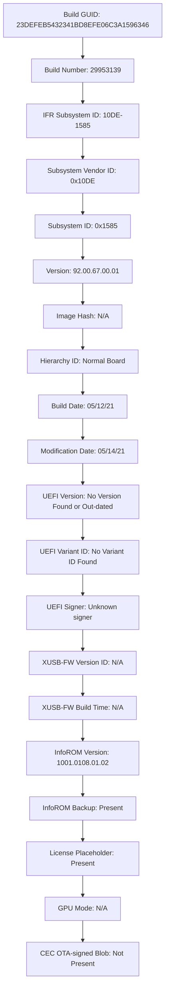

<div align="center">
  <h1>✨️ NVIDIA CMP 170HX 64GB Unlocked VBIOS</h1>

[](#)
[](#)
[](#)

First public standalone **64GB HBM2e** VBIOS dump (Device ID: `10DE 20C2`) for **NVIDIA CMP 170HX** accelerator cards. Unlocks full memory capacity for AI inference, local LLM execution, and compute workloads on both Windows and Linux.

------

## 📌 Overview

`0x20C2` This repository contains the raw 1020 KB (1 MB) ROM dump extracted directly from an unlocked CMP 170HX card, enabling the full 64GB HBM2e VRAM capacity across multi-GPU compute rigs.

------

## ⚙️ Specifications & ROM Information

| Parameter | Specification |
| :--- | :--- |
| GPU Architecture | Ampere (GA100-based) |
| Device ID | `10DE 20C2` |
| Subsystem ID | `10DE 1585` |
| VRAM Capacity | 64 GB HBM2e (Unlocked) |
| VBIOS Version | `92.00.67.00.01` |
| Build Date | 05/12/21 (Modified 05/14/21) |
| EEPROM Size | `1020 KB` (1 MB) |

------

## 🚀 How to Flash

🔹 Option A: Windows (Command Prompt as Administrator)
1. Download `nvflash64.exe` (v5.867.0 or newer).
2. Open CMD as Administrator and run:
   ```cmd
   nvflash64.exe -6 cmp170hx64gb_unlocked.rom
   ```
 • Press Y when prompted to confirm flashing across all matched device IDs.
 
 • **Reboot the system.**
 
🔹 Option B: Linux (Live USB / Driver Unloaded)
 1. Boot into system without loading the NVIDIA kernel driver (or unload via sudo rmmod nvidia_uvm nvidia).
 2. Flash using nvflash:
```cmd
   sudo ./nvflash --protectoff
```
```cmd
sudo ./nvflash -6 cmp170hx64gb_unlocked.rom
```
 • **Reboot the system**.

## 🔍 Verification
Run nvidia-smi to verify full 64GB detection:

**NVIDIA-SMI 535.129.03** | **Driver Version: 535.129.03**

| GPU | Name | Persistence-M | Bus-Id | Disp.A | Volatile Uncorr. ECC | Fan | Temp | Perf | Pwr:Usage/Cap | Memory-Usage | GPU-Util | Compute M.|
| :--- | :--- | :--- | :--- | :--- | :--- | :--- | :--- | :--- | :--- | :--- | :--- | :--- |
| 0 | CMP-170HX | Off | 00000000:08:00.0 | Off | N/A | N/A | 34C | P0 | 28W / 250W | 0MiB/ 65536MiB | 0% | Default |

---

### 💎 Reading EEPROM (this operation may take up to 30 seconds):

---

### Verificación de Integridad (SHA-256):

* **Archivo:** `cmp170hx64gb_unlockerd.rom`
* **SHA-256:** `2e8961ac518924cebd52363555c875071e6a58ece1ef494e192e42d5c1dcd5a2`

#### ¿Cómo verificar el archivo descargado?
**En Linux / Termux:**
```bash
sha256sum cmp170hx64gb_unlockerd.rom
```
**En Windows (PowerShell):**
```bash
Get-FileHash -Algorithm SHA256 cmp170hx64gb_unlockerd.rom
```
**En la terminal de Linux:**
```bash
sha256sum cmp170hx64gb_unlockerd.rom
```
**Si el archivo es correcto, la consola les devolverá el mismo código:**
```text
2e8961ac518924cebd52363555c875071e6a58ece1ef494e192e42d5c1dcd5a2
```

## 👤 Author & Acknowledgments:

 • Dump & Testing: **Thaurock**
 • Special thanks: The open-source hardware, AI inference, and LLM self-hosting community.

---

### ​📄 Licencia:

<div align="center">
Desarrollado con 💚 por <strong>Thaurock</strong>
</div>
